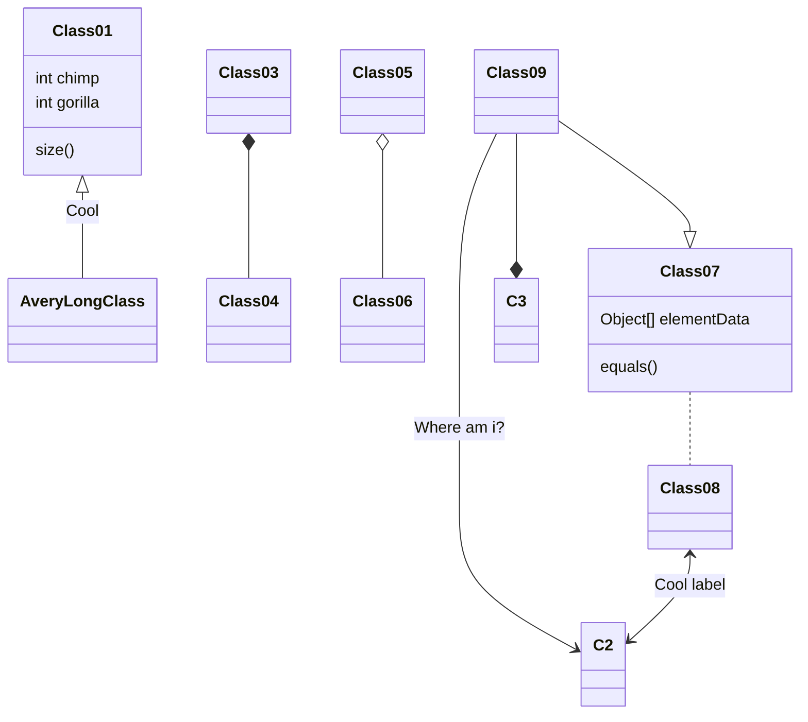
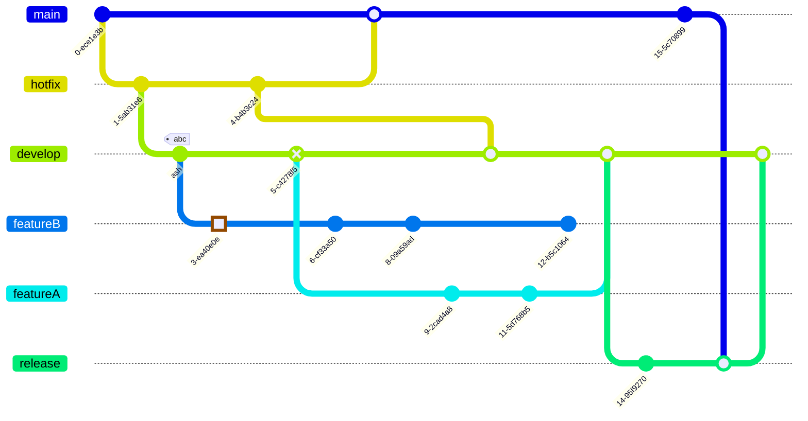
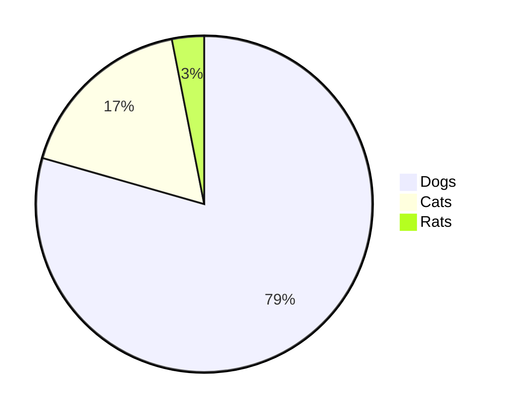

+++
title = "Post Rendering Example en"
date = "2025-02-15T21:28:46+08:00"
lastmod = "2026-01-08T15:42:56+08:00"
draft = false
tags = ["Hugo","Markdown","HackYourHeart"]
categories = "Development"
slug= "6380a9"
weight = 1
cover = ""

+++

Hello，Read this pdf：

# Text Style

1. **bold text**
2. *italicized text*
3. <u>underlined</u>
4. <u>_underlined italicized_</u>
5. ~~strikethrough~~
6. `inline code`
7. ***bold and italic***
8. _~~**bold and strikethrough and ilalic**~~_

```
**bold text**
*italicized text*
<u>underlined</u>
<u>_underlined italicized_</u>
~~strikethrough~~
`inline code`
***bold and italic***
_~~**bold and strikethrough and ilalic**~~_
```

**Long Text**

Hugo is a static site generator written in Go, optimized for speed and designed for flexibility. With its advanced templating system and fast asset pipelines, Hugo renders a complete site in seconds, often less. Use Hugo’s embedded web server during development to instantly see changes to content, structure, behavior, and presentation. Then deploy the site to your host, or push changes to your Git provider for automated builds and deployment.

**Horizontal Rule**

------


# List Style

## Unordered Lists
* Bullet points (using an asterisk)
  - Sub-items (using a hyphen)
    + Tertiary items (using a plus sign)
* [ ] Task list incomplete
* [x] Task list completed

## Ordered list
1. First item
2. Second item
1. Nested sub-items
2. Using the same number
3. The third item

## Definition list


First Term
: This is the definition of the first term.

Second Term
: This is one definition of the second term.
: This is another definition of the second term.

------

# Links and Images

## 1、Standard link

[GitHub](https://github.com)

```
[GitHub](https://github.com)
```

## 2、Link with hover title

[Hover Effect](https://example.com "Hover Title")

```
[Hover Effect](https://example.com "Hover Title")
```

## 3、Direct link

<https://autolink.example>

```
<https://autolink.example>
```

## 4、Image example:


```

```

## 5、Resized image: 


```

```

# Code Block

**Fence syntax**

Here, Chroma’s fence syntax is supported, allowing you to customize the highlighting of specific code lines and name code blocks. Other design elements such as tables, anchors, and the like have already been implemented in the site and cannot be configured here.

```js {hl_lines=["9-12",14,16],linenostart=78,title="app.js"}
function copy(object1, object2) {
  if (typeof object1 !== 'object' || object1 === null ||
      typeof object2 !== 'object' || object2 === null) {
    return;
  }

  for (let key in object2) {
    if (
      typeof object2[key] === 'object' &&
      object2[key] !== null &&
      typeof object1[key] === 'object' &&
      object1[key] !== null
    ) {
      copy(object1[key], object2[key]); // safe ?
    } else {
      object1[key] = object2[key]; // safe ?
    }
  }
}
```

~~~markdown
```js {hl_lines=["9-12",14,16],linenostart=78,title="app.js"}
function copy(object1, object2) {
  if (typeof object1 !== 'object' || object1 === null ||
      typeof object2 !== 'object' || object2 === null) {
    return;
  }

  for (let key in object2) {
    if (
      typeof object2[key] === 'object' &&
      object2[key] !== null &&
      typeof object1[key] === 'object' &&
      object1[key] !== null
    ) {
      copy(object1[key], object2[key]); // safe ?
    } else {
      object1[key] = object2[key]; // safe ?
    }
  }
}
```
~~~


# Table and Quote

**Table：**

| Left-aligned      |           Center-aligned           | Right-aligned |
| :---------------- | :--------------------------------: | ------------: |
| Content1          |              Content2              |      Content3 |
| Long-text example | Uses the vertical bar \| character |       $100.00 |

```markdown
| Left-aligned      |           Center-aligned           | Right-aligned |
| :---------------- | :--------------------------------: | ------------: |
| Content1          |              Content2              |      Content3 |
| Long-text example | Uses the vertical bar \| character |       $100.00 |
```

**Quote：**

> This is a quoted text
>
> Multi-line quoted content
>
> > Nested quote

```markdown
> This is a quoted text
>
> Multi-line quoted content
>
> > Nested quote
```


# Mathematical Formula

## 1、Inline formula

Inline formula：$E = mc^2$

```markdown
$E = mc^2$
```

## 2、Fraction

Fraction：$\frac{1}{2}$

```markdown
$\frac{1}{2}$
```

## 3、Block-level formula

$$
\begin{bmatrix}
   a & b \\
   c & d
\end{bmatrix}
\times
\begin{bmatrix}
   x \\
   y
\end{bmatrix}=
\begin{bmatrix}
   ax + by \\
   cx + dy
\end{bmatrix}
$$

```markdown
$$
\begin{bmatrix}
   a & b \\
   c & d
\end{bmatrix}
\times
\begin{bmatrix}
   x \\
   y
\end{bmatrix}=
\begin{bmatrix}
   ax + by \\
   cx + dy
\end{bmatrix}
$$
```

# ShortCode

## 1、PDF



```markdown

```

## 2、Youtube

This shortcode is built into Hugo. For more shortcodes, visit: [Hugo ShortCodes](https://gohugo.io/shortcodes/)



```markdown

```


## 3、Bilibili

Because the Hugo theme demo doesn’t allow external links, there’s no Bilibili example available—only the code usage is provided.

```markdown

```


## 4、Video

You can specify an external URL or a relative path here, such as /hugo_tutorial.mp4.



```markdown

```

# Post encryption

Encryption is true encryption, not merely obfuscation or pseudo-encryption.

The encryption algorithm is AES-GCM. Decryption invokes the browser’s WebCrypto API for decryption and features built-in hardware acceleration, resulting in extremely fast decryption speeds. It can only run on HTTPS and localhost.

Add the field `password="123456"` to the front-matter of the post, and the article and its table of contents will be encrypted according to the password you enter.

# Other elements

## 1、HTML Mixing

<span style="color:red">Red Text</span>

```html
<span style="color:red">Red Text</span>
```

## 2、Emoji

:smile: :rocket: :warning: :heart: 

```emoji
:smile: :rocket: :warning: :heart: 
```

## 3、Ruby notation

<ruby>汉<rt>hàn</rt>字 <rt>zì</rt></ruby>

<ruby>漢<rt>かん</rt>字<rt>じ</rt></ruby>

```html
<ruby>汉<rt>hàn</rt>字 <rt>zì</rt></ruby>
<ruby>漢<rt>かん</rt>字<rt>じ</rt></ruby>
```

## 4、Mermaid diagram example

Only the goat, class, git, and pie chart types are shown here; for other chart types, refer to the official Mermaid documentation.

**goat diagram：**

```goat
+-------------------+                           ^                      .---.
|    A Box          |__.--.__    __.-->         |      .-.             |   |
|                   |        '--'               v     | * |<---        |   |
+-------------------+                                  '-'             |   |
                       Round                                       *---(-. |
  .-----------------.  .-------.    .----------.         .-------.     | | |
 |   Mixed Rounded  | |         |  / Diagonals  \        |   |   |     | | |
 | & Square Corners |  '--. .--'  /              \       |---+---|     '-)-'       .--------.
 '--+------------+-'  .--. |     '-------+--------'      |   |   |       |        / Search /
    |            |   |    | '---.        |               '-------'       |       '-+------'
    |<---------->|   |    |      |       v                Interior                 |     ^
    '           <---'      '----'   .-----------.              ---.     .---       v     |
 .------------------.  Diag line    | .-------. +---.              \   /           .     |
 |   if (a > b)     +---.      .--->| |       | |    | Curved line  \ /           / \    |
 |   obj->fcn()     |    \    /     | '-------' |<--'                +           /   \   |
 '------------------'     '--'      '--+--------'      .--. .--.     |  .-.     +Done?+-'
    .---+-----.                        |   ^           |\ | | /|  .--+ |   |     \   /
    |   |     | Join        \|/        |   | Curved    | \| |/ | |    \    |      \ /
    |   |     +---->  o    --o--        '-'  Vertical  '--' '--'  '--  '--'        +  .---.
 <--+---+-----'       |     /|\                                                    |  | 3 |
                      v                             not:line    'quotes'        .-'   '---'
  .-.             .---+--------.            /            A || B   *bold*       |        ^
 |   |           |   Not a dot  |      <---+---<--    A dash--is not a line    v        |
  '-'             '---------+--'          /           Nor/is this.            ---
```


~~~markdown
```goat
+-------------------+                           ^                      .---.
|    A Box          |__.--.__    __.-->         |      .-.             |   |
|                   |        '--'               v     | * |<---        |   |
+-------------------+                                  '-'             |   |
                       Round                                       *---(-. |
  .-----------------.  .-------.    .----------.         .-------.     | | |
 |   Mixed Rounded  | |         |  / Diagonals  \        |   |   |     | | |
 | & Square Corners |  '--. .--'  /              \       |---+---|     '-)-'       .--------.
 '--+------------+-'  .--. |     '-------+--------'      |   |   |       |        / Search /
    |            |   |    | '---.        |               '-------'       |       '-+------'
    |<---------->|   |    |      |       v                Interior                 |     ^
    '           <---'      '----'   .-----------.              ---.     .---       v     |
 .------------------.  Diag line    | .-------. +---.              \   /           .     |
 |   if (a > b)     +---.      .--->| |       | |    | Curved line  \ /           / \    |
 |   obj->fcn()     |    \    /     | '-------' |<--'                +           /   \   |
 '------------------'     '--'      '--+--------'      .--. .--.     |  .-.     +Done?+-'
    .---+-----.                        |   ^           |\ | | /|  .--+ |   |     \   /
    |   |     | Join        \|/        |   | Curved    | \| |/ | |    \    |      \ /
    |   |     +---->  o    --o--        '-'  Vertical  '--' '--'  '--  '--'        +  .---.
 <--+---+-----'       |     /|\                                                    |  | 3 |
                      v                             not:line    'quotes'        .-'   '---'
  .-.             .---+--------.            /            A || B   *bold*       |        ^
 |   |           |   Not a dot  |      <---+---<--    A dash--is not a line    v        |
  '-'             '---------+--'          /           Nor/is this.            ---
```
~~~

**class diagram：**



~~~markdown

~~~

**git diagram：**



~~~markdown

~~~

**Pie diagram：**



~~~markdown

~~~

------

