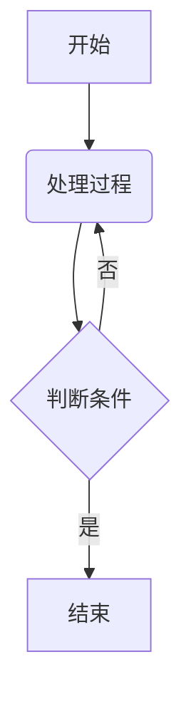
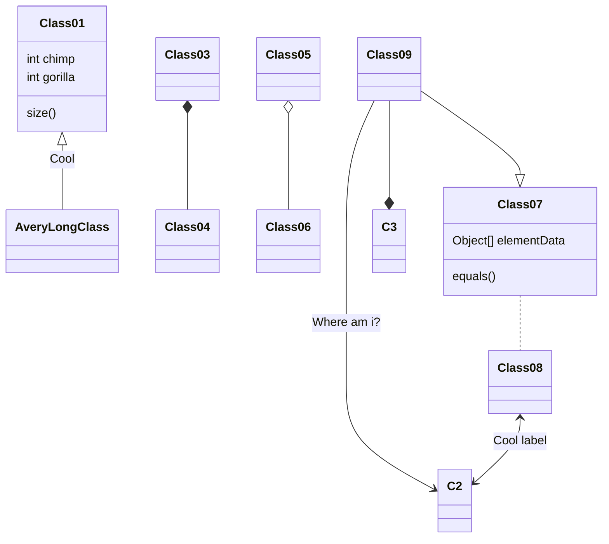
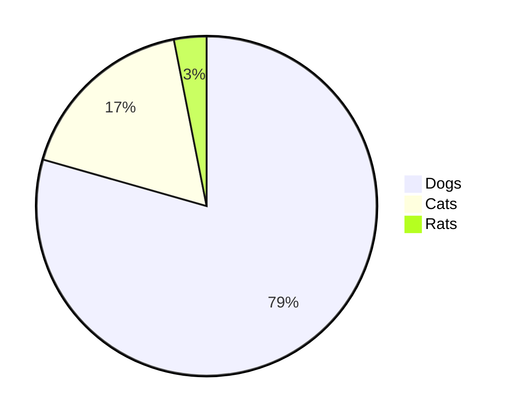
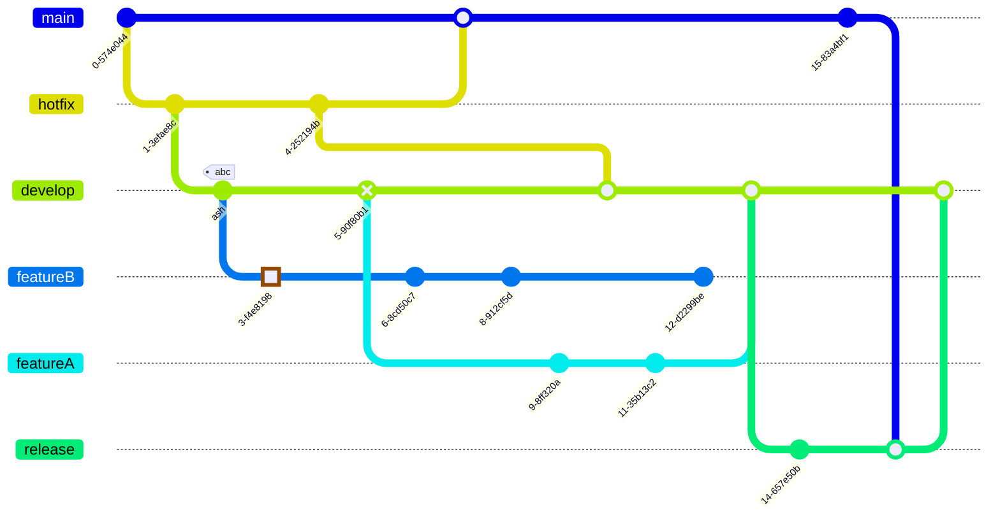

+++
title = "本主题Markdown渲染测试文件"
date = "2025-01-22T15:07:04+08:00"
draft = false
lastmod = ""
tags = [ "MarkDown", "网页渲染", "Hugo", "博客"]
categories = "主题开发"
slug = "95b26f"
cover = ""

+++

测试本主题的Markdown渲染

# 一级标题
## 二级标题
### 三级标题
#### 四级标题
##### 五级标题
###### 六级标题

分割线

---

## 段落与换行
这是普通段落文本，包含**加粗文字**和*斜体文字*，也可以使用__下划线加粗__和_下划线斜体_。行尾添加两个空格  
实现强制换行效果。

段落之间用空行分隔。

新段落开始，这里演示~~删除线~~和`行内代码`，以及组合效果：***加粗斜体***和~~**加粗删除**~~。

---

## 列表系统

### 无序列表
* 项目符号（星号）
  - 子项（连字符）
    + 三级项（加号）
* [ ] 任务列表未完成
* [x] 任务列表已完成

### 有序列表
1. 第一项
2. 第二项
   1. 嵌套子项
   2. 使用相同数字
3. 第三项

### 定义列表（扩展语法）
术语一
: 定义内容一

术语二
: 定义内容二第一段
: 定义内容二第二段

---

## 链接与图片

标准链接：[GitHub](https://github.com)  
带标题链接：[Hover效果](https://example.com "悬浮标题")  
直接链接：<https://autolink.example>  
引用式链接：[参考链接][1]

图片示例：  
  
带尺寸图片：

[1]: https://reference.example.com

---

## 代码区块

行内代码：`print("Hello World")`

缩进代码：
    def factorial(n):
        return 1 if n == 0 else n * factorial(n-1)

围栏代码（指定语言）：

这里支持chroma的围栏语法，可以自定义高亮代码行。代码文件名。其他表格、锚点等等设计我已写到站点里，这里不能再设置。

~~~markdown {title="下面代码块的围栏语法"}
```rust {hl_lines=[9,"15-17"],linenostart=199,title="test.rs"}
```
~~~


```rust {hl_lines=[9,"15-17"],linenostart=199,title="test.rs"}
struct A;          // Concrete type `A`.
struct S(A);       // Concrete type `S`.
struct SGen<T>(T); // Generic type `SGen`.

fn reg_fn(_s: S) {}

fn gen_spec_t(_s: SGen<A>) {}

fn gen_spec_i32(_s: SGen<i32>) {}

fn generic<T>(_s: SGen<T>) {}

fn main() {
    // Using the non-generic functions
    reg_fn(S(A));          // Concrete type.
    gen_spec_t(SGen(A));   // Implicitly specified type parameter `A`.
    gen_spec_i32(SGen(6)); // Implicitly specified type parameter `i32`.

    // Explicitly specified type parameter `char` to `generic()`.
    generic::<char>(SGen('a'));

    // Implicitly specified type parameter `char` to `generic()`.
    generic(SGen('c'));
}
```

语法高亮测试：
```javascript
const data = [
  { id: 1, name: 'Item 1' },
  { id: 2, name: 'Item 2' }
];
console.log(JSON.stringify(data, null, 2));
```

---

## 表格系统

基础表格：
| 左对齐     |    居中对齐    |  右对齐 |
| :--------- | :------------: | ------: |
| 内容1      |     内容2      |   内容3 |
| 长文本示例 | 使用竖线\|字符 | $100.00 |

---

## 引用与注释

标准引用：
> 这是引用文本  
> 多行引用内容
> > 嵌套引用

带来源的引用：
> 《论语》  
> -- 孔子

脚注示例[^1]和行内脚注[^这是行内脚注内容]

---

## 数学公式（扩展语法）

行内公式`$E = mc^2$`：$E = mc^2$

分数 `$\frac{1}{2}$`: $\frac{1}{2}$

块级公式：

```latex
$$
\begin{bmatrix}
   a & b \\
   c & d
\end{bmatrix}
\times
\begin{bmatrix}
   x \\
   y
\end{bmatrix}=
\begin{bmatrix}
   ax + by \\
   cx + dy
\end{bmatrix}
$$
```


$$
\begin{bmatrix}
   a & b \\
   c & d
\end{bmatrix}
\times
\begin{bmatrix}
   x \\
   y
\end{bmatrix}=
\begin{bmatrix}
   ax + by \\
   cx + dy
\end{bmatrix}
$$

---

## 其他元素

HTML混合：<span style="color:red">红色文字</span>

表情符号（扩展）: :smile: :rocket: :warning: :heart: 

Ruby注释: 漢かん字じ漢かん字じ<ruby>漢<rt>かん</rt>字<rt>じ</rt></ruby>

mermaid图示例（扩展）：

goat图

~~~markdown
```goat
+-------------------+                           ^                      .---.
|    A Box          |__.--.__    __.-->         |      .-.             |   |
|                   |        '--'               v     | * |<---        |   |
+-------------------+                                  '-'             |   |
                       Round                                       *---(-. |
  .-----------------.  .-------.    .----------.         .-------.     | | |
 |   Mixed Rounded  | |         |  / Diagonals  \        |   |   |     | | |
 | & Square Corners |  '--. .--'  /              \       |---+---|     '-)-'       .--------.
 '--+------------+-'  .--. |     '-------+--------'      |   |   |       |        / Search /
    |            |   |    | '---.        |               '-------'       |       '-+------'
    |<---------->|   |    |      |       v                Interior                 |     ^
    '           <---'      '----'   .-----------.              ---.     .---       v     |
 .------------------.  Diag line    | .-------. +---.              \   /           .     |
 |   if (a > b)     +---.      .--->| |       | |    | Curved line  \ /           / \    |
 |   obj->fcn()     |    \    /     | '-------' |<--'                +           /   \   |
 '------------------'     '--'      '--+--------'      .--. .--.     |  .-.     +Done?+-'
    .---+-----.                        |   ^           |\ | | /|  .--+ |   |     \   /
    |   |     | Join        \|/        |   | Curved    | \| |/ | |    \    |      \ /
    |   |     +---->  o    --o--        '-'  Vertical  '--' '--'  '--  '--'        +  .---.
 <--+---+-----'       |     /|\                                                    |  | 3 |
                      v                             not:line    'quotes'        .-'   '---'
  .-.             .---+--------.            /            A || B   *bold*       |        ^
 |   |           |   Not a dot  |      <---+---<--    A dash--is not a line    v        |
  '-'             '---------+--'          /           Nor/is this.            ---
```
~~~

```goat
+-------------------+                           ^                      .---.
|    A Box          |__.--.__    __.-->         |      .-.             |   |
|                   |        '--'               v     | * |<---        |   |
+-------------------+                                  '-'             |   |
                       Round                                       *---(-. |
  .-----------------.  .-------.    .----------.         .-------.     | | |
 |   Mixed Rounded  | |         |  / Diagonals  \        |   |   |     | | |
 | & Square Corners |  '--. .--'  /              \       |---+---|     '-)-'       .--------.
 '--+------------+-'  .--. |     '-------+--------'      |   |   |       |        / Search /
    |            |   |    | '---.        |               '-------'       |       '-+------'
    |<---------->|   |    |      |       v                Interior                 |     ^
    '           <---'      '----'   .-----------.              ---.     .---       v     |
 .------------------.  Diag line    | .-------. +---.              \   /           .     |
 |   if (a > b)     +---.      .--->| |       | |    | Curved line  \ /           / \    |
 |   obj->fcn()     |    \    /     | '-------' |<--'                +           /   \   |
 '------------------'     '--'      '--+--------'      .--. .--.     |  .-.     +Done?+-'
    .---+-----.                        |   ^           |\ | | /|  .--+ |   |     \   /
    |   |     | Join        \|/        |   | Curved    | \| |/ | |    \    |      \ /
    |   |     +---->  o    --o--        '-'  Vertical  '--' '--'  '--  '--'        +  .---.
 <--+---+-----'       |     /|\                                                    |  | 3 |
                      v                             not:line    'quotes'        .-'   '---'
  .-.             .---+--------.            /            A || B   *bold*       |        ^
 |   |           |   Not a dot  |      <---+---<--    A dash--is not a line    v        |
  '-'             '---------+--'          /           Nor/is this.            ---
```

流程图

~~~markdown

~~~


类图

~~~markdown

~~~


饼图

~~~markdown

~~~


Git图

~~~markdown

~~~


其他时序图、状态图、甘特图就不写了，搜一下mermaid图即可

---

## 综合测试区

这个段落包含**多种**样式组合：
1. 列表项包含`代码`和[链接](#)
2. 在*斜体文字*中嵌入^[行内脚注]
3. 表格中的**强调**：
   | 特征 | 描述               |
   | ---- | ------------------ |
   | 重要 | 必须使用`特殊处理` |

数学公式与代码混合：
当 \( x > 0 \) 时：
```python
if x > 0:
    print("Positive")
else:
    print("Non-positive")
```

最后测试段落的**边界情况**：
- 空值处理：``
- 特殊符号：*~`!@#$%^&*()_+-=[]{}|;':",./<>?
- 长文本测试：Lorem ipsum dolor sit amet, consectetur adipiscing elit. Sed do eiusmod tempor incididunt ut labore et dolore magna aliqua. Ut enim ad minim veniam, quis nostrud exercitation ullamco laboris nisi ut aliquip ex ea commodo consequat.

[^1]:这里是第一个脚注